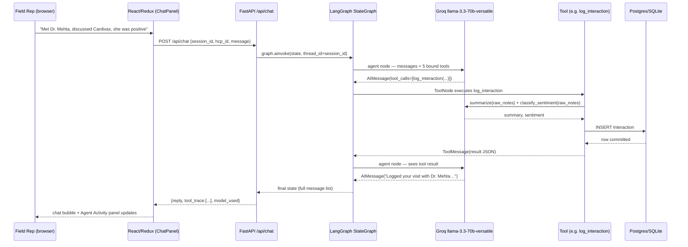
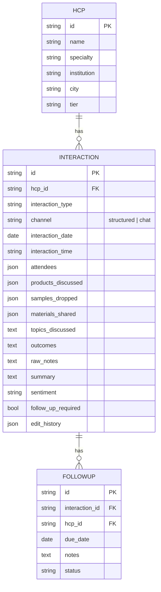

# Architecture

## Request flow — a rep sends a chat message



## Why a hand-built `StateGraph` instead of `create_react_agent`

LangGraph ships a one-line `create_react_agent` helper that hides this exact loop. This project
builds it explicitly with `StateGraph` + `add_conditional_edges` + `ToolNode` instead, because:

1. **It's explainable.** The video walkthrough needs to show *how* the orchestration works, not
   just that it works — a visible `agent → tools → agent → END` graph is what "describe the role
   of the LangGraph agent" is actually asking for.
2. **It's the same primitive real production agents use.** More complex flows (parallel tool
   fan-out, human-in-the-loop approval before a write, multi-agent handoff) all extend this same
   `StateGraph` shape — `create_react_agent` doesn't leave room to grow into those.
3. **Tool-call tracing falls out for free.** Because nothing is hidden inside a prebuilt
   abstraction, `routes_chat.py` can walk the exact message list the graph produced and pair every
   `AIMessage.tool_calls` entry with its `ToolMessage` result — which is what drives the frontend's
   Agent Activity panel.

## Request flow — the structured form path

The structured form skips the agent graph entirely and calls `POST /api/interactions` directly —
there's no ambiguity to resolve (the rep already picked every field), so routing it through an LLM
tool-call loop would just add latency for no benefit. It still calls the LLM directly, though, for
the same two enrichment steps the chat tool does (summarize `topics_discussed`, infer sentiment),
using the same prompts in `app/agents/prompts.py`. This is why the README calls out "one data
model, two entry paths" — the enrichment logic isn't duplicated, it's just invoked from two
different call sites (a tool vs. a route handler) so both paths produce the same shape of record.

## How the agent loop was verified without live Groq access

The sandbox this project was built in only allows network egress to package registries
(PyPI, npm) — not `api.groq.com` — so the LangGraph *orchestration* was verified with the real
graph, real tools, and a real SQLite database, but a mocked LLM standing in for Groq:

```python
class FakeLLM:
    async def ainvoke(self, messages):
        # turn 1: return an AIMessage with a tool_call for log_interaction
        # turn 2: return a plain AIMessage (the final reply)
        ...

with patch("app.agents.graph.agent_llm", return_value=fake_llm):
    result = await build_graph(db).ainvoke({...})
```

This confirmed: the `agent → tools → agent → END` routing fires correctly, `log_interaction`
actually writes to the database (verified by querying it back afterward), and the trace-extraction
logic `routes_chat.py` uses to build the Agent Activity panel correctly pairs each tool call with
its result. The only thing that could not be exercised in that sandbox is the live Groq API call
itself — which only requires a valid `GROQ_API_KEY` and normal internet access to work, both of
which are outside the sandbox's control. Every LLM call site also has a try/except fallback so a
transient provider issue degrades gracefully instead of crashing the request (see `README.md` §7).

## Data model


